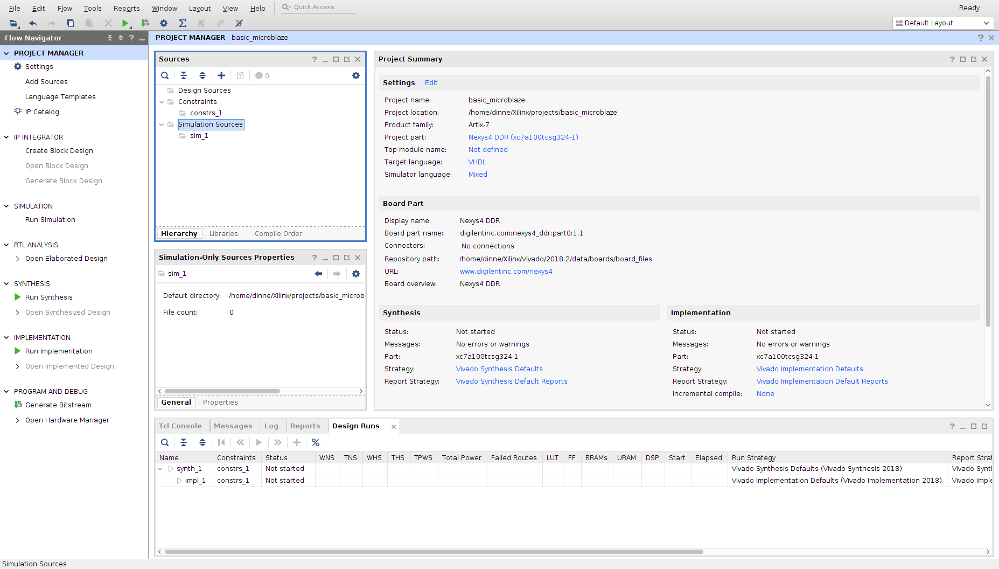
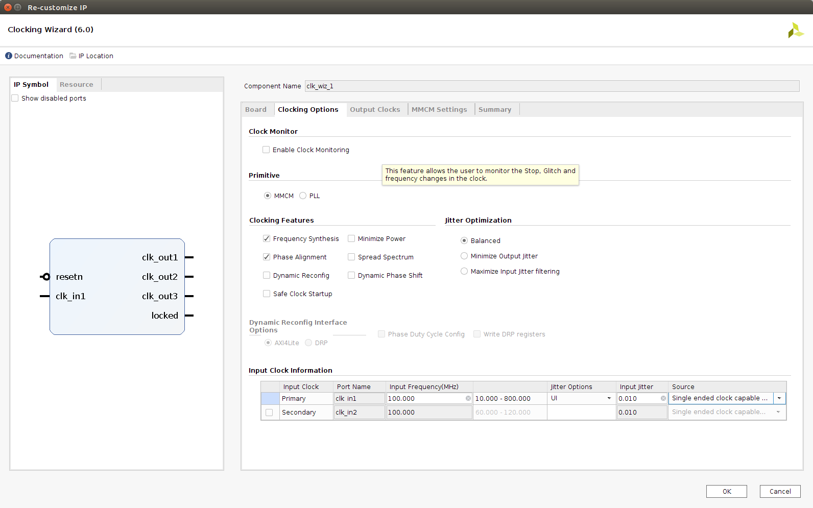
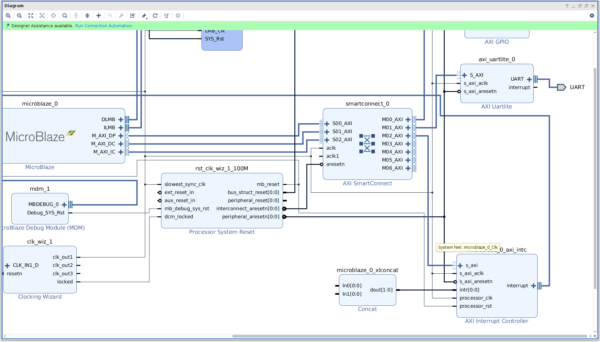
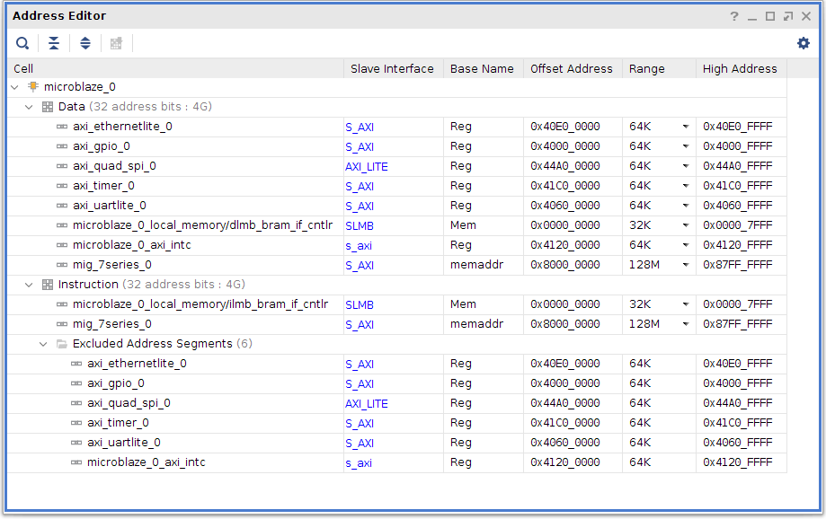
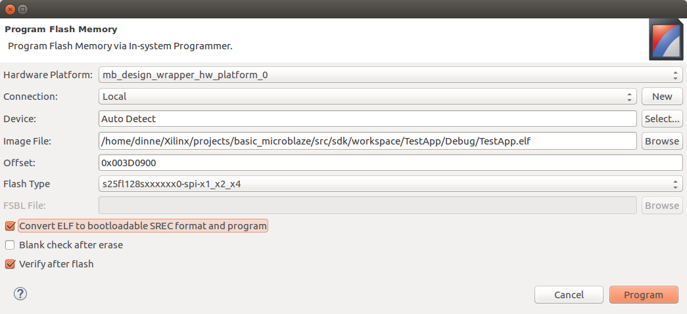

The goal is to develop an additive synthesis engine. The synthesizer needs a processor to implement high level functionality. In this article a small step is taken by making it possible to run C/C++ code on a Microblaze processor. The idea is that once we have a general computing platform we can more easily develop high level C programs that interface with custom hardware peripherals, such as the I2S transmitter and [sine wave generator](https://dwjbosman.github.io/vhdl-sine-wave-oscillator) described in previous articles.

There are quite a number of tutorials about setting up a Microblaze processor. Unfortunately most of these tutorials are either out of date or they are lacking some essential information. This article shows how to get a Microblaze running on a Nexys4 DDR development kit. The designed platform has the following features:

  * Run an user application from the on board DDR2 ram.
  * UART support for debugging
  * Ethernet (lite) support for lwIP stack
  * SPI flash support for bootloading from flash.
  * Use of AXI GPIO for simple LED control

This tutorial is setup as follows:

<h2>Table of contents</h2>

<ul>
<li><a href="#1-previous-work">1. Previous work</a></li>
<li>

<a href="#2-create-the-project">2. Create the project</a>

<ul>
<li><a href="#21-screenshots">2.1. Screenshots:</a></li>
<li><a href="#22-initializing-version-control-git">2.2. Initializing version control (git)</a></li>
<li><a href="#23-create-constraints-file-xdc">2.3. Create constraints file (XDC)</a></li>
</ul>
</li>
<li>

<a href="#3-create-the-block-design">3. Create the block design</a>

<ul>
<li>

<a href="#31-microblaze">3.1. Microblaze</a>

<ul>
<li><a href="#311-vivado-screen-shots">3.1.1. Vivado screen shots</a></li>
</ul>
</li>
<li>

<a href="#32-clocking-wizard">3.2. Clocking wizard</a>

<ul>
<li><a href="#321-vivado-screen-shots">3.2.1. Vivado screen shots</a></li>
</ul>
</li>
<li>

<a href="#33-axi-smartconnect">3.3. AXI SmartConnect</a>

<ul>
<li><a href="#331-vivado-screen-shots">3.3.1 Vivado screen shots</a></li>
</ul>
</li>
<li>

<a href="#34-axi-gpio">3.4. AXI GPIO</a>

<ul>
<li><a href="#341-vivado-screen-shots">3.4.1. Vivado screen shots</a></li>
</ul>
</li>
<li>

<a href="#35-axi-uartlite">3.5. AXI UARTlite</a>

<ul>
<li><a href="#351-vivado-screen-shots">3.5.1. Vivado screen shots</a></li>
</ul>
</li>
<li><a href="#36-axi-interrupt-controller">3.6. AXI Interrupt controller</a></li>
<li><a href="#37-axi-timer">3.7. AXI Timer</a></li>
<li>

<a href="#38-axi-ethernetlite">3.8. AXI Ethernetlite</a>

<ul>
<li><a href="#381-vivado-screen-shots">3.8.1. Vivado screen shots</a></li>
</ul>
</li>
<li><a href="#39-axi-quad-spi">3.9. AXI Quad SPI</a></li>
<li>

<a href="#310-axi-ddr2-controller">3.10. AXI DDR2 controller</a>

<ul>
<li><a href="#3101-vivado-screen-shots">3.10.1 Vivado screen shots</a></li>
</ul>
</li>
<li><a href="#311-address-map">3.11. Address map</a></li>
</ul>
</li>
<li><a href="#4-xdc-pin-constraints">4. XDC pin constraints</a></li>
<li><a href="#5-synthesize">5. Synthesize</a></li>
<li><a href="#6-generate-bit-file">6. Generate bit file</a></li>
<li><a href="#7-commit-the-block-design-to-version-control">7. Commit the block design to version control</a></li>
<li>

<a href="#8-sdk-software-development">8. SDK, software development</a>

<ul>
<li>

<a href="#81-create-bootloader-and-bsp">8.1. Create bootloader and BSP.</a>

<ul>
<li><a href="#811-configure-bootloader-bsp">8.1.1. Configure Bootloader BSP</a></li>
<li><a href="#812-configure-bootloader">8.1.2. Configure Bootloader</a></li>
<li><a href="#813-programming-the-fpga">8.1.3. Programming the FPGA</a></li>
<li><a href="#814-flashing-the-fpga-bitstream">8.1.4. Flashing the FPGA bitstream.</a></li>
</ul>
</li>
<li>

<a href="#82-create-user-application">8.2. Create user application</a>

<ul>
<li><a href="#821-configure-testapp-bsp">8.2.1. Configure TestApp BSP</a></li>
<li><a href="#822-configure-the-testapp">8.2.2. Configure the TestApp</a></li>
<li><a href="#823-flashing-the-user-application">8.2.3. Flashing the user application</a></li>
</ul>
</li>
<li><a href="#83-committing-the-sdk-code">8.3. Committing the SDK code</a></li>
</ul>
</li>
<li><a href="#9-conclusion">9. Conclusion</a></li>
</ul>

# 1. Previous work
 
I started following [Microblaze server](https://reference.digilentinc.com/learn/programmable-logic/tutorials/nexys-4-ddr-getting-started-with-microblaze-servers/start) tutorial from Digilent. It misses some information in the block design to complete Ethernet and DDR2 configuration. I used this [MIG7](https://www.instructables.com/id/Configuring-the-MIG-7-Series-to-Use-the-DDR-Memory/) tutorial to implement the DDR2 ram. Lastly I followed this tutorial on [Bootloading](https://reference.digilentinc.com/learn/programmable-logic/tutorials/htsspisf/start) to implement the bootloader.

# 2. Create the project

  * First set up the project. Add this [Vivado TCL script](https://github.com/barbedo/vivado-git) to your start up scripts. The script will create a project TCL file every time 'git commit' is invoked. The TCL project file will contain relative paths which allows your project to be stored in a version control system. 
  * Download and install the [Nexys4 DDR board](https://github.com/Digilent/vivado-boards.git) files.

After Vivado starts click the 'create project' button.

## 2.1. Screenshots:

  * Start Vivado

  * Create project

  * Choose RTL project

  *Select Nexys 4 DDR

  * Project Summary

  * The Vivado IDE is opened

## 2.2. Initializing version control (git)

After completing the wizard, open the TCL tab and type the following commands:

  1. go to your project folder: cd /home/[username]/Xilinx/projects/basic\_microblaze/
  2. create a src and blockdesign directory. The src directory will contain all the files that are kept under version control. The other files are generated by the vivado project tcl script that is generated by Vivado when we execute "git commit".

    exec mkdir -p src/blockdesign

  3. create a directory for vhdl files: 

    exec mkdir -p src/design

  4. create a folder for the SDK (C sources): 

    exec mkdir -p src/sdk/workspace

  5. create a folder for the SDK hardware definition: 

    exec mkdir -p src/sdk/hardware

  6. initialize the repository: 

    git init

  7. apply first commit: 

    git commit -am "first commit" 

## 2.3. Create constraints file (XDC)

Add an empty XDC in the  project folder: .../basic\_microblaze/src/design/design.xdc. In the TCL window run

    git add src/design/design.xdc

# 3. Create the block design

First step is to specify the architecture of the synthesized FPGA hardware blocks. Pay careful attention to configuration of the clock wizard, the MIG7 memory generator and polarity of reset signals. 

Add the block design in the  project folder: /home/[username]/Xilinx/projects/basic\_microblaze/src/blockdesign

  * Create the block design:

  * The Block Design window:

## 3.1. Microblaze

Click on the '+' button and search for "Microblaze". After adding the Microblaze processor click on it to customize it:
  1. wizard page 1: enable the Debug Module (MDM) and enable caches.
  2. wizard page 2: next
  3. wizard page 3: select 16 kB instruction cache, and a 16 kB data cache.
  4. wizard page 4: next
  5. wizard page 5: Enable AXI data interface

A green box will appear containing a link to "Run block automation". Clicking the link and Vivado will create additional IP blocks to support the Microblaze. When clicking "Run block automation" a settings window will appear:
  1. Choose local memory 16 KB
  2. Choose cache configuration: 16 KB. 
  3. Choose Debug module Debug Only
  4. Select enable Peripheral AXI Port
  5. Select enable interrupt controller
  6. Choose to create a new clocking wizard (100 MHz)

The block design will now contain a Microblaze, Local memory, Processor System Reset, Interrupt controller (and concat block), Clocking wizard and AXI interconnect.

  7. Later another Processor System Reset block will be added. Rename the existing one to "cpu\_sys\_reset".

### 3.1.1. Vivado screen shots

  * Add Microblaze

  * Microblaze customize general

  * Microblaze customize instructions 
 
  * Microblaze customize cache 
 
  * Microblaze customize debug 
 
  * Microblaze customize bus
 
  * Microblaze block automation 
 
  * Microblaze block design result 
 

## 3.2. Clocking wizard

Double click the "clocking wizard" to customize it:
  1. On the clock options page select "single ended clock capability" for the row "primary".
  2. On the output clocks page:
    1. Add two extra output clocks besides the existing 100 MHz clock: 200 MHz and 50 MHz. 
    2. Also on the this page choose the reset type: active low
  3. Finish the wizard and right click the "clk\_in1" port. Select "make inputs external". A new external input will be created. Rename it to "CLK100MHZ"
  3. Right click the "resetn" port. Select make inputs external. A new external input will be created. Rename it to "reset\_n"
  4. Connect the "reset\_n" port to the  "ext\_reset\_n" port of the Processor System Reset block.
These clocks are generated using the FPGA's built in MMCM which can be thought of as a kind of PLL. The 200 MHz will be used for the DDR2 controller, the 50 MHz for the Quad SPI Flash and external Ethernet LAN8720A chip. The reset button signal on the Nexys4 DDR will measure as a '0' when pressed. To use this button for resetting the various IP blocks every reset input port has to be configured as "active low". Renaming the ports is required to match the physical pin constraints in the XDC file. Add the following rows to the XDC file:

    set\_property -dict {PACKAGE\_PIN E3 IOSTANDARD LVCMOS33} [get\_ports CLK100MHZ]
    create\_clock -period 10.000 -name sys\_clk\_pin -waveform {0.000 5.000} -add [get\_ports CLK100MHZ]
    set\_property -dict {PACKAGE\_PIN C12 IOSTANDARD LVCMOS33} [get\_ports reset\_n]

### 3.2.1. Vivado screen shots

  * Add clocking wizard 

  * Options page 1

  * Clocking wizard output options

  * Make ports external 

## 3.3. AXI SmartConnect

In a first attempt I added a DDR2 controller. The 'run block automation' reappeared. After running it an "AXI SmartConnect" appeared. I wondered why this was a different component comparing it to the "AXI interconnect" created by the Microblaze Block Automation. The documentation notes that both "Axi SmartConnect"  and "Axi interconnect" have similar functionality and that "Axi SmartConnect" supersedes "Axi interconnect". In all the examples I saw using Microblaze and DDR RAM there were two "Axi interconnect/smartconnect" blocks. In this design I will use one to keep things simple. I'll have to check later how this impacts performance.

  1. Delete the existing "AXI interconnect"
  2. Add an "AXI SmartConnect"

Double click the "AXI SmartConnect" it to customize:
  1. Select the number of slaves: 3 (Microblaze data path, data cache and instruction cache)
  2. Select the number of masters: 7 (GPIO, Uartlite, ethernetlite, timer, MIG7, Quad SPI, Interrupt)
  3. Select the number of clocks: 2 (the MIG7 will use the second clock input)
  4. Enable reset input: has resetn input: 1

Connect the block:
  1. Connect microblaze M\_AXI\_DP, M\_AXI\_DC, M\_AXI\_IC to the input AXI slave interfaces: S00\_AXI, S01\_AXI, S02\_AXI
  2. Connect the "clockin wizard" 100Mhz clock (clk\_out1) to the aclk pin.
  3. Connect the "processor system reset" output port "interconnect\_aresetn" to the resetn input

The AXI SmartConnect is configures such that all the memory interfacing (including IO mapped peripherals) runs through it. Two clocks are required because the DDR2 controller is part of a different clock domain.

### 3.3.1 Vivado screen shots

  * Add SmartConnect IP

  * SmartConnect configuration

  * SmartConnect connections

## 3.4. AXI GPIO

The AXI GPIO IP block is used to control general purpose input/output pins. In our case only outputs are used to control an RGB LED on the Nexys4 DDR board. Add the AXI GPIO block, double click to configure:

  1. Select "All outputs"
  2. Select "GPIO width" as 3 pins.
  3. Select default value: "0x10".
  4. Finish the wizard and right click the GPIO port. Select make external. A new external output will be created. Rename it to "GPIO"

Connect the block:
  1. Connect the M00\_AXI of the "AXI SmartConnect" to the S\_AXI input.
  2. Connect the "clocking wizard" 100Mhz clock (clk\_out1) to the s\_axi\_aclk pin.
  3. Connect the "processor system reset" output port "peripheral\_aresetn" to the s\_axi\_aresetn input
  4. Add the following rows to the XDC file:

        set\_property -dict {PACKAGE\_PIN G14 IOSTANDARD LVCMOS33} [get\_ports {GPIO\_tri\_o[0]}]
        set\_property -dict {PACKAGE\_PIN R11 IOSTANDARD LVCMOS33} [get\_ports {GPIO\_tri\_o[1]}]
        set\_property -dict {PACKAGE\_PIN N16 IOSTANDARD LVCMOS33} [get\_ports {GPIO\_tri\_o[2]}]

The GPIO width is chosen to 3 to be able to control the Red, Green and Blue channel of the RGB LED. The output is renamed to "GPIO" so that physical pin constraints can be configured (later on) in the XDC file.

### 3.4.1. Vivado screen shots

  * Add AXI gpio IP

  * GPIO Configuration 

  * GPIO Connections

## 3.5. AXI UARTlite

The AXI UARTlite IP block allows the processor to communicate via serial port to the outside world. The C/C++ print routines will make use of this serial port. Add the IP and customize it by double clicking:
  1. Select 38400 as a Baudrate
  2. Finish the wizard and right click the UART port. Select make external. A new external output will be created. Rename it to "UART"

Connect the block:
  1. Connect the M01\_AXI of the "AXI SmartConnect" to the S\_AXI input.
  2. Connect the "clocking wizard" 100Mhz clock (clk\_out1) to the s\_axi\_aclk pin.
  3. Connect the "processor system reset" output port "peripheral\_aresetn" to the s\_axi\_aresetn input
  4. The interrupt pin is not connected.
  5. Add the following pin constraints to the XDC file:

        set\_property -dict {PACKAGE\_PIN D4 IOSTANDARD LVCMOS33} [get\_ports UART\_txd]
        set\_property -dict {PACKAGE\_PIN C4 IOSTANDARD LVCMOS33} [get\_ports UART\_rxd]

The serial port is accessible via USB. It uses the same USB port which is also used for JTAG and FPGA/Microblaze programming.

### 3.5.1. Vivado screen shots

  * UART lite settings  

  * UART connections  

## 3.6. AXI Interrupt controller

The interrupt controller signals the Microblaze once an external event needs to be handled by the processor. Interrupts are generated by the Timer and Ethernetlite component. 
  1. Add a Concat block if it is not already connected to the interrupt controller.
  2. Connect "dout" of the Concat block to intr of the interrupt controller
  3. Connect "interrupt" output of the Interrupt Controller to the Microblaze "interrupt" input.
  4. Connect the "clocking wizard" 100Mhz clock (clk\_out1) to the "s\_axi\_aclk" pin.
  5. Connect the "processor system reset" output port "peripheral\_aresetn" to the s\_axi\_aresetn input
  6. Connect the "processor\_clk" input to "s\_axi\_aclk".
  7. Connect the "processor system reset" output port "mb\_reset" to the processor\_rst input.
  8. Connect the axi bus "s\_axi" input to the "M02\_axi" output of the AXI SmartConnect.

Note that the intr input is initially displayed as intr[0:0]. This will update automatically to intr[0:1] once the design is validated.

## 3.7. AXI Timer

The Timer component implements a programmable timer. It is used by the Xilinx SDK to implement the "sleep" subroutine. Add an AXI Time IP block. Configure by double clicking:
  1. The Default settings should be ok.

Connect the block:
  1. Connect the "M03\_AXI" of the AXI SmartConnect to the "S\_AXI" input.
  2. Connect the Clocking Wizard "clk\_out1" (100Mhz clock) to the "s\_axi\_aclk" pin.
  3. Connect the Processor System Reset output port "peripheral\_aresetn" to the "s\_axi\_aresetn" input.
  4. Connect the interrupt pin to "in0" of the Concat block (which is connected to the interrupt controller).

## 3.8. AXI Ethernetlite

Note: at this point actual use of the lwIP stack has not been tested yet.

The Ethernetlite component presents a memory mapped ethernet device to the Microblaze. In the C user application running on the Microblaze the lwIP stack will be used to connect to the Internet.  The Ethernetlite component presents a MII interface. The Nexys4 DDR contains a LAN8720A chip which already implements part of this interface. That chip presents a so called reduced MII interface. Xilinx has a MII\_to\_RMII IP block available to convert. Add both the "AXI Ethernetlite" and "Ethernet PHY MII to Reduced MII" to the block design.

Configure the AXI Ethernetlite block:
  1. Enable Internal Loopback

Create two external output ports:
  1. Create an output port "ETH\_RST\_N" of type 'other'.
  2. Create an output port "ETH\_CLK" of type 'clock'.

Connect the blocks:
  1. Connect the "M04\_AXI" of the AXI SmartConnect to the "S\_AXI" input.
  2. Connect the Clocking Wizard "clk\_out1" (100Mhz clock) to the "s\_axi\_aclk" pin.
  3. Connect the Processor System Reset output port "peripheral\_aresetn" to the "s\_axi\_aresetn" input.
  4. Connect the interrupt "ip2intc\_irpt" pin to "in1" of the Concat block (which is connected to the interrupt controller).
  5. Connect the Clocking Wizard "clk\_out3" (50Mhz clock) to the "ref\_clk" pin.
  6. Connect the Clocking Wizard "clk\_out3" (50Mhz clock) to the "ETH\_CLK" external pin.
  7. Connect the Ethernetlite port "MII" to the "MII" port of the MII\_to\_RMII block.
  8. Right click the "MDIO" port, make it external. Rename it to "MDIO"
  9. Right click the "RMII\_PHY\_M" port, make it external. Rename to "RMII\_PHY\_M".
  10. Expand the "MII" port of the Ethernetlite device.
    1. Connect the "phy\_rst\_n" pin of the MII bus to the "rst\_n\_rmii" of the MII\_to\_RMII block.
    2. Connect the "phy\_rst\_n" pin of the MII bus to the "ETH\_RST\_N" external pin.
    3. Collapse the "MII" port.
  11. Add the following constraints to the XDC file:

        set\_property -dict {PACKAGE\_PIN C9 IOSTANDARD LVCMOS33} [get\_ports MDIO\_mdc]
        set\_property -dict {PACKAGE\_PIN A9 IOSTANDARD LVCMOS33} [get\_ports MDIO\_mdio\_io]
        set\_property -dict {PACKAGE\_PIN B3 IOSTANDARD LVCMOS33} [get\_ports ETH\_RST_N]
        set\_property -dict {PACKAGE\_PIN D9 IOSTANDARD LVCMOS33} [get\_ports RMII\_PHY_M\_crs\_dv]
        set\_property -dict {PACKAGE\_PIN C10 IOSTANDARD LVCMOS33} [get\_ports RMII\_PHY_M\_rx\_er]
        set\_property -dict {PACKAGE\_PIN C11 IOSTANDARD LVCMOS33} [get\_ports {RMII\_PHY_M\_rxd[0]}]
        set\_property -dict {PACKAGE\_PIN D10 IOSTANDARD LVCMOS33} [get\_ports {RMII\_PHY_M\_rxd[1]}]
        set\_property -dict {PACKAGE\_PIN B9 IOSTANDARD LVCMOS33} [get\_ports RMII\_PHY\_M\_tx\_en]
        set\_property -dict {PACKAGE\_PIN A10 IOSTANDARD LVCMOS33} [get\_ports {RMII\_PHY\_M\_txd[0]}]
        set\_property -dict {PACKAGE\_PIN A8 IOSTANDARD LVCMOS33} [get\_ports {RMII\_PHY\_M\_txd[1]}]
        set\_property -dict {PACKAGE\_PIN D5 IOSTANDARD LVCMOS33} [get\_ports ETH\_CLK]
        #set\_property -dict { PACKAGE\_PIN B8 IOSTANDARD LVCMOS33 } [get\_ports { ETH\_INTN }];

In most tutorials the 50MHz clock is used to drive the LAN8720A chip and the MII\_to\_RMII block. According to some recommendations the  MII\_to\_RMII block introduces a clock delay. Ideally the clocking wizard should be used to create two 50 MHz clocks, one with a phase delay. The un-delayed clock is connected to the MII\_to\_RMII block. The delayed clock is connected to the LAN8720A. Furthermore there is a discussion if the LAN8720A can be clocked used a synthesized 50MHz clock as there the clock jitter would be outside its datasheet specs.

### 3.8.1. Vivado screen shots

  * Ethernet lite configuration 

  * Ethernet lite clocks

  * Ethernet reset port 

  * Ethernet lite connections

## 3.9. AXI Quad SPI

The Quad SPI component is connected to the external Quad SPI Flash (A Spansion S25FL128S). It allows the FPGA to retrieve its bit stream from the Flash chip. Furthermore the Microblaze will be able to boot the user application from flash. Add a Quad SPI IP block and configure it:

  1. Select mode: quad
  2. Select the Spansion slave device.

Connect the Quad SPI block as follows:
  1. Connect the "M05\_AXI" of the AXI SmartConnect to the "S\_AXI" input.
  2. Connect the Clocking Wizard "clk\_out1" (100Mhz clock) to the "s\_axi\_aclk" pin.
  3. Connect the Processor System Reset output port "peripheral\_aresetn" to the "s\_axi\_aresetn" input.
  5. Connect the Clocking Wizard "clk\_out3" (50Mhz clock) to the "ext\_spi\_clk" pin.
  6. Right click the "SPI\_0" port, make it external and rename to "QSPI\_FLASH".
  7. Add the following pin constraints to the XDC file:

        set\_property -dict {PACKAGE\_PIN K17 IOSTANDARD LVCMOS33} [get\_ports QSPI\_FLASH\_io0\_io]
        set\_property -dict {PACKAGE\_PIN K18 IOSTANDARD LVCMOS33} [get\_ports QSPI\_FLASH\_io1\_io]
        set\_property -dict {PACKAGE\_PIN L14 IOSTANDARD LVCMOS33} [get\_ports QSPI\_FLASH\_io2\_io]
        set\_property -dict {PACKAGE\_PIN M14 IOSTANDARD LVCMOS33} [get\_ports QSPI\_FLASH\_io3\_io]
        set\_property -dict {PACKAGE\_PIN L13 IOSTANDARD LVCMOS33} [get\_ports {QSPI\_FLASH\_ss\_io[0]}]
  
  * Configure Quad SPI IP block 

  * Connect the Quad SPI IP block

## 3.10. AXI DDR2 controller

The Memory Interface Generator (MIG7) is used to create a DDR2 controller for the Micron MT47H64M16HR-25:H RAM chip on the Nexys4 DDR board. The Microblaze will use a BRAM based bootloader to copy the user application from Flash to DDR2 Ram. The DDR2 controller requires precise timing parameters. These are specified in this [DDR2 RAM tutorial](https://www.instructables.com/id/Configuring-the-MIG-7-Series-to-Use-the-DDR-Memory/). Add a MIG7 component and double click to configure:

  1. At the introduction page click Next.
  2. Again click next.
  3. Select the pin compatible FPGA. The Nexys4 DDR uses the xc7a100ti-csg324.
  4. Choose DDR2 as controller type.
  5. On the "Controller options" page select:
    1. Clock period: 3077
    2. Memory part: MT47H64M16HR-25E
    3. Datawidth: 16 bits
    4. Ordering: Normal
  6. On the "AXI Parameter" page configure the AXI interface:
    1. Data width: 128
    2. Enable narrow burst support (set to one).
  7. On the "Memory Options" page choose:
    1. Set the "input clock period" to 100 MHz. If this setting is missing chances are that you run across a bug in the Memory Interface Generator (MIG7). When running Vivado 2018.2 from Ubuntu use the right locale settings. Restart Vivado from the terminal and first execute: export LC\_NUMERIC=en\_US.utf8
    2.  Set RTT-ODT to be 50 ohms. 
  8. On the "FPGA options" page:
    1. select "no buffer" for both system clock and reference clock. "no buffer" means that we can connect clocks generated by the clocking wizard.
    2. Set the system reset polarity to active low.
    3. Enable usage of "Internal vref".
  9. On the "Extended FPGA options" choose the Internal termination impedance to be 50 omhs.
  10. On the "IO Planning" page select fixed pin out as we want to connect the controller to the external RAM chip.
  11. On the "Pin selection" page, type the pin numbers, next click validate. Refer to the XDC constraints below for the actual pin values. The pin selection page does not fit on one page, and you have to scroll to get to all the pins. Be care full when scrolling: scrolling when the mouse is above a pin selection drop down changes the pin!
  12. On the "System signals" do not select anything.
  13. Verify that the summary report is similar to the screenshot.
  14. The last pages "simulation options:": accept, "pcb information": next, "design notes": generate.

The DDR RAM controller will generate its own clock on the "ui\_clk" pin. The DDR RAM controller needs its own system reset logic as part of this clock domain. Add another "Processor System Reset", rename it to FPGA\_sys\_reset".

Connect the DDR RAM controller:
  1. Connect the AXI SmartConnect pin "M06\AXI" to the S\_AXI pin.
  2. Connect the external "reset\_n" pin to the "sys\_rst" pin of the FPGA\_sys\_reset block.
  3. Connect the clocking wizard "clk\_out1" (100 MHz) clock to "sys\_clk\_i" of the Ram controller.
  4. Connect the clocking wizard "clk\_out2" (200 MHz) clock to "clk\_ref\_i" of the RAM controller. 
  5. Right click the DDR controller "DDR2" pin and make it external. Rename the external pin to "DDR2".
  6. Connect the DDR controller "ui\_clk\_sync\_rst" to the "ext\_reset\_in" of the FPGA\_sys\_reset block.
  7. Connect the DDR controller "ui\_clk" clock to the "slowest\_sync\_clk" of the FPGA\_sys\_reset block.
  8. Connect this clock also to the "aclk1" pin of the AXI SmartConnect.
  9. Connect the "mmcm\_locked" of the DDR Controller to the  "dcm\_locked" pin of the FPGA\_sys\_reset block.
  10. The DDR Controller pin "int\_calib\_complete" is left unconnected.
  11. Connect the FPGA\_sys\_reset pin "peripheral\_aresetn" to the DDR controller "aresetn" pin. 

In some articles it is specified that one should not use a clocking wizard generated clock connected to the DDR controller as it would have too much jitter. In spite of this advice I have used the 200 MHz output of the clock wizard. The following pin constraints are required connecting the DDR RAM chip.

        set\_property -dict {PACKAGE\_PIN R7 IOSTANDARD SSTL18\_II} [get\_ports {DDR2\_dq[0]}]
        set\_property -dict {PACKAGE\_PIN V6 IOSTANDARD SSTL18\_II} [get\_ports {DDR2\_dq[1]}]
        set\_property -dict {PACKAGE\_PIN R8 IOSTANDARD SSTL18\_II} [get\_ports {DDR2\_dq[2]}]
        set\_property -dict {PACKAGE\_PIN U7 IOSTANDARD SSTL18\_II} [get\_ports {DDR2\_dq[3]}]
        set\_property -dict {PACKAGE\_PIN V7 IOSTANDARD SSTL18\_II} [get\_ports {DDR2\_dq[4]}]
        set\_property -dict {PACKAGE\_PIN R6 IOSTANDARD SSTL18\_II} [get\_ports {DDR2\_dq[5]}]
        set\_property -dict {PACKAGE\_PIN U6 IOSTANDARD SSTL18\_II} [get\_ports {DDR2\_dq[6]}]
        set\_property -dict {PACKAGE\_PIN R5 IOSTANDARD SSTL18\_II} [get\_ports {DDR2\_dq[7]}]
        set\_property -dict {PACKAGE\_PIN T5 IOSTANDARD SSTL18\_II} [get\_ports {DDR2\_dq[8]}]
        set\_property -dict {PACKAGE\_PIN U3 IOSTANDARD SSTL18\_II} [get\_ports {DDR2\_dq[9]}]
        set\_property -dict {PACKAGE\_PIN V5 IOSTANDARD SSTL18\_II} [get\_ports {DDR2\_dq[10]}]
        set\_property -dict {PACKAGE\_PIN U4 IOSTANDARD SSTL18\_II} [get\_ports {DDR2\_dq[11]}]
        set\_property -dict {PACKAGE\_PIN V4 IOSTANDARD SSTL18\_II} [get\_ports {DDR2\_dq[12]}]
        set\_property -dict {PACKAGE\_PIN T4 IOSTANDARD SSTL18\_II} [get\_ports {DDR2\_dq[13]}]
        set\_property -dict {PACKAGE\_PIN V1 IOSTANDARD SSTL18\_II} [get\_ports {DDR2\_dq[14]}]
        set\_property -dict {PACKAGE\_PIN T3 IOSTANDARD SSTL18\_II} [get\_ports {DDR2\_dq[15]}]

        set\_property -dict {PACKAGE\_PIN T6 IOSTANDARD SSTL18\_II} [get\_ports {DDR2\_dm[0]}]
        set\_property -dict {PACKAGE\_PIN U1 IOSTANDARD SSTL18\_II} [get\_ports {DDR2\_dm[1]}]

        set\_property -dict {PACKAGE\_PIN U9 IOSTANDARD DIFF\_SSTL18\_II} [get\_ports {DDR2\_dqs\_p[0]}]
        set\_property -dict {PACKAGE\_PIN V9 IOSTANDARD DIFF\_SSTL18\_II} [get\_ports {DDR2\_dqs\_n[0]}]
        set\_property -dict {PACKAGE\_PIN U2 IOSTANDARD DIFF\_SSTL18\_II} [get\_ports {DDR2\_dqs\_p[1]}]
        set\_property -dict {PACKAGE\_PIN V2 IOSTANDARD DIFF\_SSTL18\_II} [get\_ports {DDR2\_dqs\_n[1]}]

        set\_property -dict {PACKAGE\_PIN N6 IOSTANDARD SSTL18\_II} [get\_ports {DDR2\_addr[12]}]
        set\_property -dict {PACKAGE\_PIN K5 IOSTANDARD SSTL18\_II} [get\_ports {DDR2\_addr[11]}]
        set\_property -dict {PACKAGE\_PIN R2 IOSTANDARD SSTL18\_II} [get\_ports {DDR2\_addr[10]}]
        set\_property -dict {PACKAGE\_PIN N5 IOSTANDARD SSTL18\_II} [get\_ports {DDR2\_addr[9]}]
        set\_property -dict {PACKAGE\_PIN L4 IOSTANDARD SSTL18\_II} [get\_ports {DDR2\_addr[8]}]
        set\_property -dict {PACKAGE\_PIN N1 IOSTANDARD SSTL18\_II} [get\_ports {DDR2\_addr[7]}]
        set\_property -dict {PACKAGE\_PIN M2 IOSTANDARD SSTL18\_II} [get\_ports {DDR2\_addr[6]}]
        set\_property -dict {PACKAGE\_PIN P5 IOSTANDARD SSTL18\_II} [get\_ports {DDR2\_addr[5]}]
        set\_property -dict {PACKAGE\_PIN L3 IOSTANDARD SSTL18\_II} [get\_ports {DDR2\_addr[4]}]
        set\_property -dict {PACKAGE\_PIN T1 IOSTANDARD SSTL18\_II} [get\_ports {DDR2\_addr[3]}]
        set\_property -dict {PACKAGE\_PIN M6 IOSTANDARD SSTL18\_II} [get\_ports {DDR2\_addr[2]}]
        set\_property -dict {PACKAGE\_PIN P4 IOSTANDARD SSTL18\_II} [get\_ports {DDR2\_addr[1]}]
        set\_property -dict {PACKAGE\_PIN M4 IOSTANDARD SSTL18\_II} [get\_ports {DDR2\_addr[0]}]

        set\_property -dict {PACKAGE\_PIN R1 IOSTANDARD SSTL18\_II} [get\_ports {DDR2\_ba[2]}]
        set\_property -dict {PACKAGE\_PIN P3 IOSTANDARD SSTL18\_II} [get\_ports {DDR2\_ba[1]}]
        set\_property -dict {PACKAGE\_PIN P2 IOSTANDARD SSTL18\_II} [get\_ports {DDR2\_ba[0]}]

        set\_property -dict {PACKAGE\_PIN L6 IOSTANDARD DIFF\_SSTL18\_II} [get\_ports {DDR2\_ck\_p[0]}]
        set\_property -dict {PACKAGE\_PIN L5 IOSTANDARD DIFF\_SSTL18\_II} [get\_ports {DDR2\_ck\_n[0]}]

        set\_property -dict {PACKAGE\_PIN N4 IOSTANDARD SSTL18\_II} [get\_ports DDR2\_ras\_n]
        set\_property -dict {PACKAGE\_PIN L1 IOSTANDARD SSTL18\_II} [get\_ports DDR2\_cas\_n]
        set\_property -dict {PACKAGE\_PIN N2 IOSTANDARD SSTL18\_II} [get\_ports DDR2\_we\_n]
        set\_property -dict {PACKAGE\_PIN M1 IOSTANDARD SSTL18\_II} [get\_ports {DDR2\_cke[0]}]
        set\_property -dict {PACKAGE\_PIN M3 IOSTANDARD SSTL18\_II} [get\_ports {DDR2\_odt[0]}]
        set\_property -dict {PACKAGE\_PIN K6 IOSTANDARD SSTL18\_II} [get\_ports {DDR2\_cs\_n[0]}]

### 3.10.1 Vivado screen shots

  *  Add MIG7

  * MIG7 Intro page 

  *  MIG7 Output options 

  * MIG7 Select part 

  * MIG7 memory selection 

  * MIG7 Controller options 

  * MIG7 AXI Parameters 

  * MIG7 Memory options  

  * MIG7 FPGA options 

  * Extended FPGA options page 

  * Memory Controller IO Planning page

  * MIG7 Pin selection page  

  * MIG7 Pin selection page 2 

  * MIG7 System Signals page 

  * MIG7 Summary 

  * Memory controller connections

## 3.11. Address map

The connected AXI devices are either memory type devices or memory mapped IO devices. We have to specify the Microblaze memory map so that the AXI devices can be accessed by the bootloader and user application. Click the address editor tab.
  1. Right click Data area, unmapped slaves. For each of the following devices select assign address: ethernetlite, gpio, uartlite, timer, quad spi, mig7.
  2. The  "Instructions" mapped devices should only contain the local memory and the mig7 device. Select any other mapped devices and right click "exclude". 
  3. <b>Check that the Microblaze local memory sections for both data and instructions are at least 32 kB.</b>

# 4. XDC pin constraints

The XDC file specifies constraints on the physical FPGA pins. Digilent provides a [XDC file for the Nexys4 DDR](https://github.com/Digilent/digilent-xdc/blob/master/Nexys-4-DDR-Master.xdc). In this tutorial the individual pin constraints are listed with each IP block. Refer to the previous sections. In general a pin constraint is defined as follows:

        set\_property -dict {PACKAGE\_PIN K17 IOSTANDARD LVCMOS33} [get\_ports OUTPUT\_X]

It was not always easy to determine the port name (eg. OUTPUT\_X) by examining the block design visually. When the block design is completed and synthesized you can run the "get\_ports" command in the TCL window. The names of all the different block design input and output ports will then be displayed. These names can then be added to the XDC file. 

Some additional constraints are required to get rid of a warning:

        set\_property CFGBVS VCCO [current\_design]
        set\_property CONFIG\_VOLTAGE 3.3 [current\_design]

# 5. Synthesize

  1. Right click "mb\_design" in the sources pane. Click "generate HDL wrapper", select "Let Vivado manage wrapper..."

  2. Click "Run synthesis" in the "Flow Navigator".
  3. Click "Run implementation"
  4. Click "Open implemented design" and select the IO ports tab. If the XDC contains no errors. It should look like the following screenshot:

# 6. Generate bit file

Later on the FPGA bit stream will be flashed on the Quad SPI Flash device. In order to reduce the size of the bit stream and speed up booting the bit stream can be compressed. Turn compression on by adding this to the XDC file.
        
        set\_property BITSTREAM.GENERAL.COMPRESS TRUE [current\_design]

Open the tools -> settings menu. Select bit stream options under project settings. Tick the "-bin\_file" option. Open "additional settings" and tick "enable compression". A constraint will be added automatically to the XDC file:

Run the bit stream generator.

  * Set the Bit stream options

  * Additional bit stream options

# 7. Commit the block design to version control

Store the current version of the  block design inside version control:
  1. git add src/blockdesign/mb\_design/\*
  2. check with git status that no files under src are "untracked". If needed use "git add" to add remaining untracked files under src. Do not add these folders: basic\_microblaze.cache/, basic\_microblaze.hw/, basic\_microblaze.runs/, basic\_microblaze.xpr
  3. git commit --message "Block design done"

# 8. SDK, software development

First export the hardware definition. Select the File menu -> export -> export hardware. Enable "include bit stream". Choose the src/sdk/hardware folder.

Click launch "SDK" from the project menu. Choose the relevant src/sdk/workspace folder for as workspace. Vivado will start the SDK which is the Eclipse C/C++ development IDE. The workspace will contain the hardware definition "mb\_design\_wrapper....". Click the "system.hdf" file and check that the memory map is correct.

  * Export hardware

  * Launch the SDK

  * Default SDK workspace

 
## 8.1. Create bootloader and BSP.

Create a new "Application project" named "Bootloader". In the "Target software" pane select "Create new" board support package. Name the BSP "Bootloader\_bsp". Click "next" and select the "SREC SPI bootloader" template. Click "Finish".

### 8.1.1. Configure Bootloader BSP

Open the Bootloader\_bsp project and open "system.mss". Click "Modify this BSP's Settings". Select "xilisf" in the navigation tree view. Set the "serial\_flash\_family" type to 5 (Spansion). Click "Regenerate BSP sources". 

  * Open the bootloader\_bsp project

  * Modify the Bootloader BSP

  * Xilisf settings

### 8.1.2. Configure Bootloader

Open the "Bootloader" project and edit the "blconfig.h" file. The bootloader needs to know the address in SPI flash where the user application resides. Remove the warning and change the "FLASH\_IMAGE\_BASEADDR" to 0x003D0900. Select the linker "ldscript.ld" file. Set the stack size to 0x200. Check that all segments are assigned to BRAM local memory (and not the external DDR RAM as this memory will receive the user application loaded from the Flash memory). 

In bootloader.c check that SPI\_DEVICE\_ID is set to XPAR\_SPI\_0\_DEVICE\_ID. The warning line above it can then be removed.

In bootloader.c the VERBOSE flag should be defined (by default). This will cause the bootloader to print messages while the bootloading is in progress. The print output will be streamed over the UARTlite interface. The print commands unfortunately slow down the bootloading. A small modification helps. Replace the contents of the function "display\_progress" by:

    print(".")

This will speedup things while still giving some insight in the bootloading progress. After saving Eclipse will rebuild the Bootloader. If all is well the Bootloader should compile without errors now.

### 8.1.3. Programming the FPGA

In step 8.1.4. the hardware design including bootloader will be programmed into flash such that the FPGA loads it every time it boots. Configure the SPI jumper on the Nexys4 DDR development kit. This allows the FPGA to load its bit file from the SPI flash. The FPGA bit file contains the configuration of the FPGA including initial contents of the Microblaze local BRAM.  Next connect the Nexys4 DDR board via the JTAG usb connector. Start a serial terminal (eg. gtkterm) and select the port (eg. /dev/ttyUSB1) and set the baud rate to 38400 (as configured in the UARTlite block design).

Run the program FPGA command from the Xilinx menu. Select the bootloader.elf file (in the Bootloader/Debug project) in stead of "bootloop". Selecting "program" will generate a download.bit file in the "mb\_design\_wrapper\_hw\_platform\_0" project. 

After the programming completes, in the serial terminal you should see the bootloader starting (and failing).

### 8.1.4. Flashing the FPGA bitstream.

The previous step was used to generate a bit file. It was uploaded temporary to the FPGA. Storing the bit file in the Flash chip is a more permanent solution that allows the FPGA to load the design every time the Nexys4 board is reset. Click the "Program Flash" menu item in the Xilinx menu. Select the download.bit files as "image file". The offset should be 0. The flash type is "s25fl128sxxxxx0-spi-x1\_x2\_x4". Check "verify after flash". And finish by clicking "Program".

After flashing you can restart the Nexys4 DDR by pressing the "prog" button. Again the bootloader should start and fail. Note that while the FPGA can load its bit file from flash it can also still be programmed as usual using JTAG.

## 8.2. Create user application

Create a new project, named TestApp. Select Create new board support package named "TestApp\_bsp". Click next and select the "Peripheral tests" template.

### 8.2.1. Configure TestApp BSP

Open the TestApp\_bsp project and open "system.mss". Click "Modify this BSP's Settings". Enable "xilisf" and "lwip202" in the supported libraries pane. Select "xilisf" in the navigation tree view. Set the "serial\_flash\_family" type to 5 (Spansion). S

Click "Regenerate BSP sources". Probably the build will fail. There is a bug in Vivado 2018.2 lwip202, it does not define some xadapter code required to compile using EthernetLite. There is a [patch]() available. The patch has been applied manually in the [example GIT repository](https://github.com/dwjbosman/basic_microblaze_nexys4_ddr). Be care full not to regenerate the BSP sources as this will remove the patch.

The changes can be reviewed via this diff: 
 
    git diff 69b53308d4d4690ab77b53d72262df3ee429e0b d45cd8645e9563a86cef6648e0a15483d39f63f9 '*.c'

  * Set the PHY link speed to 100Mbps

### 8.2.2. Configure the TestApp

The peripherial test application does not need any configuring.

### 8.2.3. Flashing the user application

Click the "Program Flash" menu item in the Xilinx menu. Select the TestApp.elf file as "image file". The offset should be 0x003D0900 (as configured in the bootloader). The flash type is "s25fl128sxxxxx0-spi-x1\_x2\_x4". Tick "convert elf file to bootable SREC...". Check "verify after flash". And finish by clicking "Program".

Reset the Nexys4 DDR by pressing the "prog" button. The bootloader should start loading and eventually run the user application. The user application will print various test messages. The RGB LED connected to the GPIO should react to one of the tests. The last tests will test the Ethernetlite interface (you'll see the Ethernet LEDs blinking twice).

## 8.3. Committing the SDK code

First add .gitignore files to a number of folders to ignore logging files:

        src/sdk/workspace/Bootloader_bsp/.gitignore:
        *.o
        *.a

        src/sdk/workspace/TestApp_bsp/.gitignore:
        *.o
        *.a

        src/sdk/workspace/mb_design_wrapper_hw_platform_0/.gitignore:
        cache

        src/sdk/workspace/.metadata/.gitignore:
        *.log
        .lock

        src/sdk/.gitignore:
        *.jou
        *.log

Then run these commands to add the SDK files to the repo.

        git add src/sdk/hardware/mb\_design\_wrapper.hdf
        git add src/sdk/workspace/Bootloader
        git add src/sdk/workspace/Bootloader\_bsp
        git add src/sdk/workspace/TestApp
        git add src/sdk/workspace/TestApp\_bsp
        git add src/sdk/workspace/mb\_design\_wrapper\_hw\_platform\_0
        git add src/sdk/workpace/.metadata

        git commit --message "Added bootloader and test application with patched lwip202"

# 9. Conclusion

  1. Getting this the basic Microblaze architecture running requires many configuration steps. While writing this tutorial I had one working reference project and I created a new project to describe each step. The first time I ended up with a bootloader that did not fit in the BRAM. Somehow, somewhere the Microblaze cache size was set to 16 kB, instead of the required 32 kB. I suspect the block automation step to be the culprit. Luckily by checking the linker script in the SDK this was easy to find and correct.
  2. When working in Linux check your Locale settings as described in the tutorial. If set wrongly the MIG7 wizard will not snow essential settings.
  3. The Eclipse SDK crashed a few times resulting in a locked SDK which could not be restarted. Remove .lock files from the .metadata in src/sdk/workspace to get it working again. 
  4. Although lwIP is compiling I haven't had the time to do actual internet tests. The peripheral test example application however indicates the the ethernet phy is working.
  5. Performance of the Microblaze has not been checked in this tutorial.

The VHDL code can be found in the [Basic\_microblaze](https://github.com/dwjbosman/basic_microblaze_nexys4_ddr) repository.

The next step will be to implement an AXI device that presents a memory mapped interface to the audio synthesis engine. Using the lwIP stack and some C code will then allow us to send commands to the synthesis engine via UDP.

